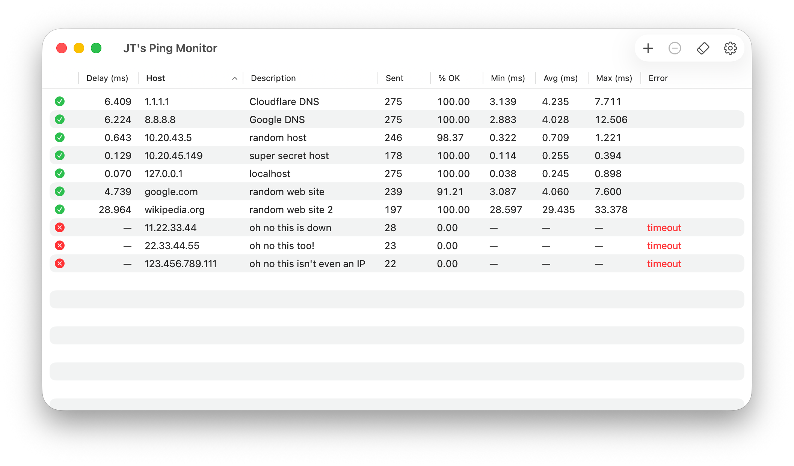
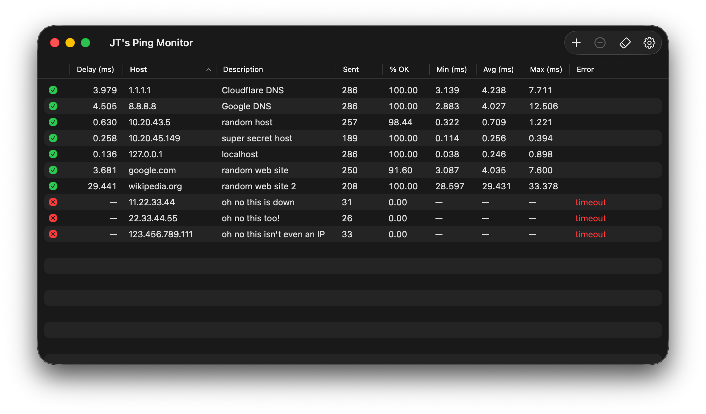
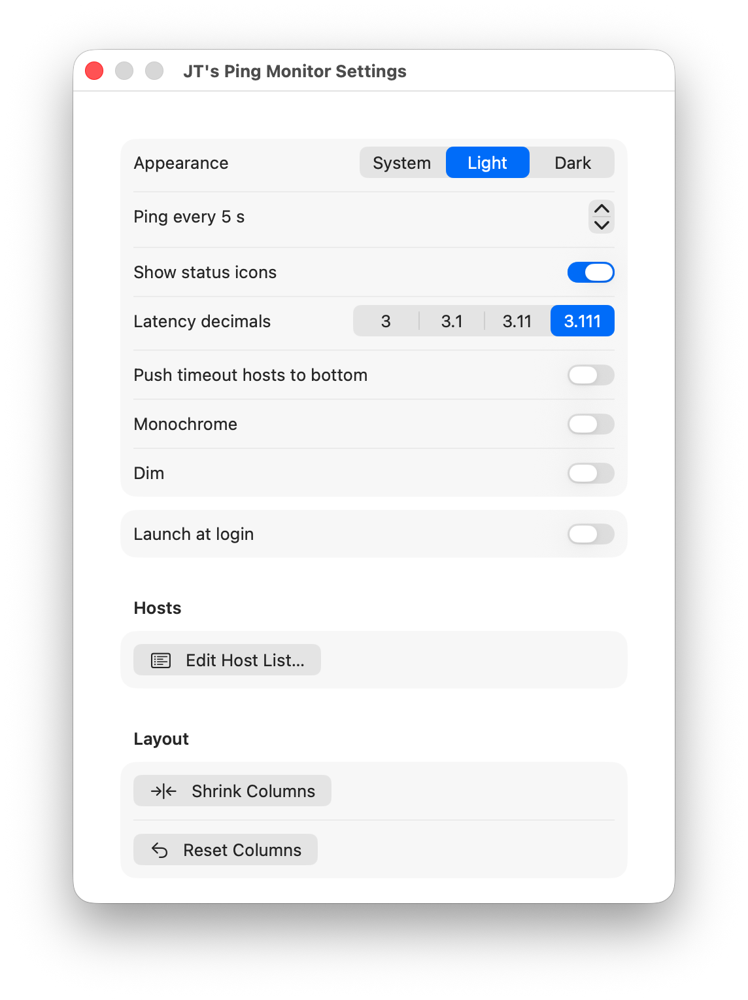
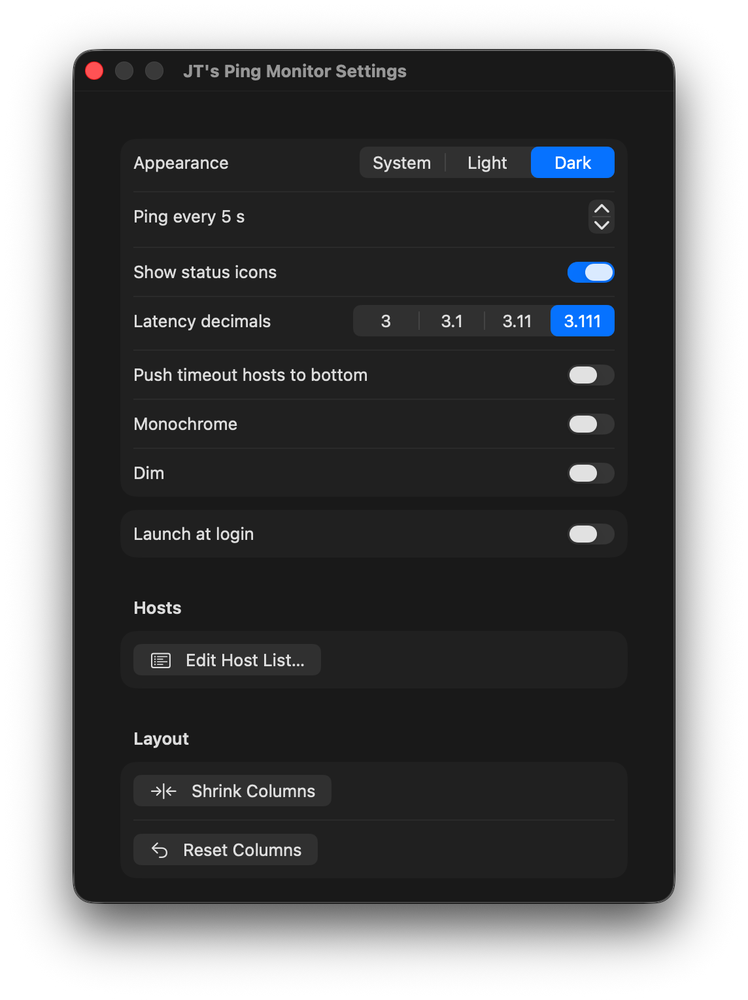

# JT's Ping Monitor

A macOS app that continuously pings a list of hosts and shows their
status, current latency, and cumulative stats (sent count, success rate,
min / avg / max) in a sortable table.

<p align="center">
  
  
</p>

- Standard dock app with a single main window
- Cumulative stats per host since the last reset (persisted across
  launches)
- Inline-edit any host's address or description (double-click a row)
- Sort by any column (sort order is remembered)
- **Compact view** toggle in the toolbar (or Settings) — collapses the
  table to Status, Delay, Host; fits columns to content and shrinks the
  window to match
- Optional "Launch at login"

Requires macOS 14+ and Xcode command-line tools (Swift 5.9+).

## Install

Download `JTs-Ping-Monitor.dmg` from the
[latest release](https://github.com/johnthomastaylor/JTs-Ping-Monitor/releases/latest),
double-click to mount, and drag **JT's Ping Monitor** into the
**Applications** folder. Open it from Applications. The DMG is signed
with an Apple Developer ID and notarized by Apple, so Gatekeeper accepts
it on first launch with no warning.

Once it's running, open Settings (⌘,) and toggle **Launch at login** if
you'd like it to start with your Mac.

## Build from source

If you'd rather build it yourself:

```sh
./scripts/build-app.sh         # produces build/JT's Ping Monitor.app
./scripts/run.sh               # build and launch
./scripts/build-dmg.sh         # produces build/JTs-Ping-Monitor.dmg (unsigned)
```

To install your local build into `/Applications`:

```sh
./scripts/build-app.sh
cp -R "build/JT's Ping Monitor.app" /Applications/
open "/Applications/JT's Ping Monitor.app"
```

### Producing a signed, notarized release DMG

Requires an Apple Developer ID Application certificate in your keychain
and a `notarytool` keychain profile (see Apple's
[notarytool docs](https://developer.apple.com/documentation/security/customizing-the-notarization-workflow)).

```sh
DEVELOPER_ID="Developer ID Application: Your Name (TEAMID)" \
NOTARY_PROFILE="ping-monitor" \
./scripts/build-dmg.sh
```

The script signs the app with the hardened runtime, signs the DMG, ships
it to Apple's notary service, waits for the ticket, and staples the
ticket onto the DMG. Upload the resulting `build/JTs-Ping-Monitor.dmg`
as a GitHub Release asset.

## Settings

<p align="center">
  
  
</p>

Settings → General:

- **Appearance** — System / Light / Dark
- **Ping every N s** — background polling interval (1–300; default 5)
- **Show status icons** — toggles the leftmost ✓/✕ column
- **Latency decimals** — `3` / `3.1` / `3.11` / `3.111`
- **Push timeout hosts to bottom** — partition down hosts to the bottom
  on top of whatever column sort is active
- **Compact view** — same toggle as the toolbar's compact button; hides
  Description / Sent / % OK / Min / Avg / Max / Error, fits the
  remaining columns to content, and shrinks the window. Toggling off
  restores the prior window width.
- **Monochrome** — drops the green/red status tint and the red error
  text in favor of `.primary`
- **Dim** + **Dim level** slider — reduce the table's opacity for a
  lower-contrast read

Settings → Hosts → **Edit Host List…** — a free-text editor
(one host per line; `address` or `address, description`) that replaces
the entire list on save. Existing addresses keep their UUID and stats;
new addresses become new hosts; addresses absent from the text are
removed. Lines starting with `#` are ignored.

Settings → Layout → **Shrink Columns** — collapses every column to its
minimum width.

Settings → Layout → **Reset Columns** — restores every column to its
default width (the layout you'd see on first launch).

## Editing hosts

- **Add** — click the `+` in the toolbar; small popover with address +
  optional description
- **Edit** — double-click a row's Host or Description cell; Enter
  commits, Esc cancels, clicking outside the two fields also cancels
- **Delete** — select one or more rows and press ⌫, or use the toolbar
  Delete button, or right-click → Delete
- **Reset stats** — toolbar eraser button (resets all, or just the
  selection if any), or right-click a row's "Reset stats". Both ask
  for confirmation.

## Where state lives

- Hosts: `~/Library/Application Support/JTsPingMonitor/hosts.json`
- Stats: `~/Library/Application Support/JTsPingMonitor/stats.json`
  (rewritten on every change)
- Preferences (appearance, interval, decimals, all the toggles, sort
  column + direction): `UserDefaults` under `com.jtt.PingMonitorDock`
- Login-at-launch registration: `SMAppService.mainApp` (system-level)

## Regenerating the app icon

The icon is rendered from an SF Symbol on a colored squircle by
`scripts/generate-icon.swift`. Edit the constants at the top of that
file (`symbolName`, `backgroundHex`, `symbolWeight`, `symbolScale`) and
run:

```sh
swift scripts/generate-icon.swift
./scripts/build-app.sh
killall Dock      # so macOS picks up the new icon immediately
```
